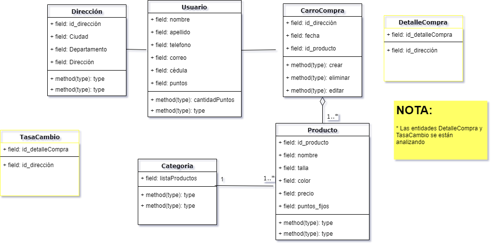

# Proyecto frow: crud de productos usando _springboot_ , _Mongodb_ , _mockito_ , _JUnit4_
* Proyecto con las últimas actulizaciones [proyecto frow](proyecto_mongodb_springboot/com.sofka.frowFinal)
* Ruta en el navegador http://localhost:8080/producto
* Nombre base datos: __producto__
* Las pruebas unitarias se realizaron con JUnit4 usando Mockito
* Diagrama del dominio, se implemento solo la entidad producto como práctica de análisis del proyecto 
